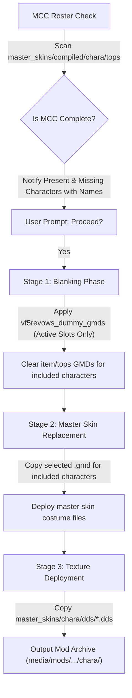

# VF5 REVO - Mod Compiler Option 3: Master Skin Mod Specification

**Feature Name:** Mod Compiler Option 3 — Master Skin Mod  
**Source Templates Path:** `C:\Users\casan\Documents\github\VF5REVOWS_PXDArchiver_GatherToolset\vf5revows_dummy_gmds`  
**Source Skins Path:** `C:\Users\casan\Documents\github\VF5REVOWS_PXDArchiver_GatherToolset\master_skins`  
**Audit & Spec Date:** August 20, 2026  

---

## 📌 Executive Overview

The **Master Skin Mod** option (Option 3 in the Mod Compiler tool) automates full character costume overrides and force-skin modifications in Virtua Fighter 5 R.E.V.O.

It converts default base costumes into high-value crossover skins (e.g. VF1 Retro Low-Poly, Yakuza / Like a Dragon Crossover, Tekken 7 Crossover, or Swimsuit DLC skins) while blanking out all unwanted modular item meshes (`vf5item`) to prevent visual clipping.

---

## ⚡ MCC Pre-Check & 3-Stage Compilation Pipeline

### Pre-Stage: MCC Roster Completeness & Duplicate Check
- **Suboption Modes**:
  1. **Suboption 1 (`master_skins/compiled`)**: Pre-scans character costume folders under `master_skins/compiled/chara/tops`.
  2. **Suboption 2 (`master_skins/mods`)**: Pre-scans individual mod directories under `master_skins/mods` for `.gmd` models and `.dds` textures per mod folder.
  3. **Suboption 3 (`Whitelisted Common Dummy Bones Guide`)**: Interactive guide listing all 118 Whitelisted Common Dummy Bones and rigging rules.
  4. **Suboption 4 (`Bone Weight Categorical Audit Report`)**: Scans all `.gmd` files across `master_skins/` directories and generates a comprehensive categorical audit report of vertex weights (allowed common dummy bones, allowed character physics bones, and non-common bones) logged to `./output/master_skin_bone_weight_audit_report.log`.
- **Duplicate `.gmd` Validation**: Verifies that only ONE master skin `.gmd` model is present per character code. If multiple `.gmd` files exist for the same character, compilation aborts with detailed file conflict paths.
- **Error Dump Log Generation**: Whenever duplicate character model conflicts or non-common bone weight errors occur, a full error dump log is automatically generated and saved to `./output/master_skin_error_dump.log` (or `master_skin_bone_error_dump.log`), and its exact location is prominently printed to the console output.
- **Chest Physics Test & Location Enforcement (Both Suboption 1 & 2)**:
  - Pre-scans `.gmd` models for female characters (`AOI` and `SAR`) for breast/chest physics weights (`j_0_munl_000wj`/`j_0_munr_000wj` for AOI, `j_opal_015wj`/`j_opar_014wj` for SAR).
  - **Folder Location Rules**:
    - Mods for `AOI` / `SAR` **WITH** breast/chest physics **MUST** be placed in `master_skins/special_chest_physics/`. If detected in standard `master_skins/compiled/` or `master_skins/mods/`, compilation aborts with instructions and dumps `master_skin_chest_physics_error_dump.log`.
    - Mods **WITHOUT** breast/chest physics (e.g. SAR `c_v64_VF5_SAR_TEK.gmd` or AOI `AOI003_JO_OUT_01.gmd`, `AOI023_JO_OUT_03.gmd`, `AOI033_JO_OUT_04.gmd`) remain in `master_skins/compiled/` (Suboption 1) or `master_skins/mods/` (Suboption 2) respectively.
- **AOI Master Skin Base Exception**:
  - `c_v10_VF5_AOI.gmd` is excluded from AOI master skin replacement.
  - Approved AOI master skin models without chest physics (`AOI003_JO_OUT_01.gmd`, `AOI023_JO_OUT_03.gmd`, `AOI033_JO_OUT_04.gmd`) or with chest physics (`c_v8e_VF5_AOI_SWIM.gmd`, `c_v73_VF5_AOI_TEK.gmd`, `AOI013_JO_OUT_02.gmd`, `AOI343_JO_OUT_05.gmd`) replace `{targetFolder}.gmd` across AOI costume slots.
- **Roster Validation:** Maps character codes to full character names (e.g., Akira Yuki for `AKI`, Sarah Bryant for `SAR`, etc.) and notifies the user of present vs. missing characters.
- **Prompt:** User is prompted to proceed (`1. Yes / 2. No`).
- **Omission Rule:** If MCC is incomplete, any missing character slots are **OMITTED** from the rest of the compilation pipeline (skipping Stage 1 GMD dummy blanking and Stage 2 master skin deployment for those character slots).

### Stage 1: Item & Costume Blanking Phase
- **Action:** Recurse through target `vf5item` and `tops` folders.
- **Source Assets:** [`vf5revows_dummy_gmds`](../../vf5revows_dummy_gmds/) (21 character-specific master dummy templates).
- **Result:** All default item meshes (hats, shirts, shoes, jackets, accessories) are zeroed out (0 rendered faces), while retaining 100% of character skeleton armatures.

### Stage 2: Master Skin Replacement Phase
- **Action:** Target base costume folders (`c_v00_VF5_<CHAR>` through `c_v20_VF5_<CHAR>`).
- **Source Assets:** Selected costume variant `.gmd` files from `master_skins\chara\tops\` or `master_skins\mods\`.
- **Replacement Rule:**
  1. Delete original `c_vXX_VF5_<CHAR>\c_vXX_VF5_<CHAR>.gmd`.
  2. Copy selected variant `.gmd` (e.g. `c_v21_VF5_AKI_VF1.gmd` or `c_v42_VF5_AKI_RYU.gmd`).
  3. Rename copied file to match the target base costume filename (`c_v00_VF5_AKI.gmd`).

### Stage 3: Texture Asset Deployment Phase
- **Action:** Copy all high-resolution `.dds` texture files from `master_skins\chara\dds\` or `master_skins\mods\` directly into the mod directory (`chara\dds\`).

---

## 👤 Character-by-Character Replacement Mapping

| Code | Character Name | Target Base Folder & File | Selectable Master Skin Variants from `master_skins\chara\tops\` |
| :---: | :--- | :--- | :--- |
| `AKI` | Akira Yuki | `c_v00_VF5_AKI\c_v00_VF5_AKI.gmd` | `c_v21_..._VF1` (VF1 P1), `c_v21_..._VF1_2` (VF1 P2), `c_v42_..._RYU` (Yakuza Kiryu), `c_v63_..._TEK` (Tekken Kazuya), `c_v84_..._SWIM` (Swimsuit) |
| `SAR` | Sarah Bryant | `c_v01_VF5_SAR\c_v01_VF5_SAR.gmd` | `c_v22_..._VF1`, `c_v22_..._VF1_2`, `c_v43_..._RYU` (Yakuza Majima), `c_v64_..._TEK` (Tekken Nina), `c_v85_..._SWIM` |
| `LAU` | Lau Chan | `c_v02_VF5_LAU\c_v02_VF5_LAU.gmd` | `c_v23_..._VF1`, `c_v23_..._VF1_2`, `c_v44_..._RYU`, `c_v65_..._TEK` (Tekken Heihachi), `c_v86_..._SWIM` |
| `SHU` | Shun Di | `c_v03_VF5_SHU\c_v03_VF5_SHU.gmd` | `c_v24_..._VF1`, `c_v24_..._VF1_2`, `c_v45_..._RYU`, `c_v66_..._TEK`, `c_v87_..._SWIM` |
| `JEF` | Jeffry McWild | `c_v04_VF5_JEF\c_v04_VF5_JEF.gmd` | `c_v25_..._VF1`, `c_v25_..._VF1_2`, `c_v46_..._RYU`, `c_v67_..._TEK`, `c_v88_..._SWIM` |
| `PAI` | Pai Chan | `c_v05_VF5_PAI\c_v05_VF5_PAI.gmd` | `c_v26_..._VF1`, `c_v26_..._VF1_2`, `c_v47_..._RYU`, `c_v68_..._TEK` (Tekken Xiaoyu), `c_v89_..._SWIM` |
| `JAK` | Jacky Bryant | `c_v06_VF5_JAK\c_v06_VF5_JAK.gmd` | `c_v27_..._VF1`, `c_v27_..._VF1_2`, `c_v48_..._RYU`, `c_v69_..._TEK` (Tekken Paul), `c_v8a_..._SWIM` |
| `KAG` | Kage-Maru | `c_v07_VF5_KAG\c_v07_VF5_KAG.gmd` | `c_v28_..._VF1`, `c_v28_..._VF1_2`, `c_v49_..._RYU`, `c_v70_..._TEK`, `c_v8b_..._SWIM` |
| `LIO` | Lion Rafale | `c_v08_VF5_LIO\c_v08_VF5_LIO.gmd` | `c_v29_..._VF1`, `c_v29_..._VF1_2`, `c_v50_..._RYU`, `c_v71_..._TEK`, `c_v8c_..._SWIM` |
| `WOL` | Wolf Hawkfield | `c_v09_VF5_WOL\c_v09_VF5_WOL.gmd` | `c_v30_..._VF1`, `c_v30_..._VF1_2`, `c_v51_..._RYU` (Yakuza Saejima), `c_v72_..._TEK` (Tekken King), `c_v8d_..._SWIM` |
| `AOI` | Aoi Umenokouji | `c_v10_VF5_AOI\c_v10_VF5_AOI.gmd` | `c_v31_..._VF1`, `c_v31_..._VF1_2`, `c_v52_..._RYU`, `c_v73_..._TEK` (Tekken Jun), `c_v8e_..._SWIM` |
| `LEI` | Lei-Fei | `c_v11_VF5_LEI\c_v11_VF5_LEI.gmd` | `c_v32_..._VF1`, `c_v32_..._VF1_2`, `c_v53_..._RYU`, `c_v74_..._TEK` (Tekken Kazuya), `c_v8f_..._SWIM` |
| `VAN` | Vanessa Lewis | `c_v12_VF5_VAN\c_v12_VF5_VAN.gmd` | `c_v33_..._VF1`, `c_v33_..._VF1_2`, `c_v54_..._RYU`, `c_v75_..._TEK`, `c_v90_..._SWIM` |
| `BRA` | Brad Burns | `c_v13_VF5_BRA\c_v13_VF5_BRA.gmd` | `c_v34_..._VF1`, `c_v34_..._VF1_2`, `c_v55_..._RYU`, `c_v76_..._TEK`, `c_v91_..._SWIM` |
| `GOH` | Goh Hinogami | `c_v14_VF5_GOH\c_v14_VF5_GOH.gmd` | `c_v35_..._VF1`, `c_v35_..._VF1_2`, `c_v56_..._RYU`, `c_v77_..._TEK`, `c_v92_..._SWIM` |
| `MON` | El Blaze | `c_v15_VF5_MON\c_v15_VF5_MON.gmd` | `c_v36_..._VF1`, `c_v36_..._VF1_2`, `c_v57_..._RYU`, `c_v78_..._TEK`, `c_v93_..._SWIM` |
| `MSK` | Eileen | `c_v16_VF5_MSK\c_v16_VF5_MSK.gmd` | `c_v37_..._VF1`, `c_v37_..._VF1_2`, `c_v58_..._RYU`, `c_v79_..._TEK`, `c_v94_..._SWIM` |
| `KRT` | Jean Kujo | `c_v17_VF5_KRT\c_v17_VF5_KRT.gmd` | `c_v38_..._VF1`, `c_v38_..._VF1_2`, `c_v59_..._RYU`, `c_v80_..._TEK`, `c_v95_..._SWIM` |
| `TAK` | Taka-Arashi | `c_v18_VF5_TAK\c_v18_VF5_TAK.gmd` | `c_v39_..._VF1`, `c_v39_..._VF1_2`, `c_v60_..._RYU`, `c_v81_..._TEK`, `c_v96_..._SWIM` |
| `TST` | Test / Dev Slot | `c_v19_VF5_TST\c_v19_VF5_TST.gmd` | `c_v40_..._VF1`, `c_v40_..._VF1_2`, `c_v61_..._RYU`, `c_v82_..._TEK`, `c_v97_..._SWIM` |
| `DUR` | Dural | `c_v20_VF5_DUR\c_v20_VF5_DUR.gmd` | `c_v41_..._VF1`, `c_v41_..._VF1_2`, `c_v62_..._RYU`, `c_v83_..._TEK`, `c_v98_..._SWIM` |

---

## 🏷️ Costume Category Index

| Category Tag | Slot Range | Suffix Filter | Example Folder | Description |
| :--- | :--- | :--- | :--- | :--- |
| **VF1 Retro P1** | `c_v21` - `c_v41` | `*_VF1` | `c_v21_VF5_AKI_VF1` | Original Virtua Fighter 1 Retro Low-Poly P1 Costume |
| **VF1 Retro P2** | `c_v21` - `c_v41` | `*_VF1_2` | `c_v21_VF5_AKI_VF1_2` | Original Virtua Fighter 1 Retro Low-Poly P2 Costume |
| **Yakuza Crossover** | `c_v42` - `c_v62` | `*_RYU` | `c_v42_VF5_AKI_RYU` | Ryu Ga Gotoku / Like a Dragon Crossover Outfits |
| **Tekken 7 Crossover** | `c_v63` - `c_v83` | `*_TEK` | `c_v63_VF5_AKI_TEK` | Tekken 7 Character Collaboration Outfits |
| **Swimsuit DLC** | `c_v84` - `c_v98` | `*_SWIM` | `c_v84_VF5_AKI_SWIM` | Summer Swimsuit DLC Outfits |
